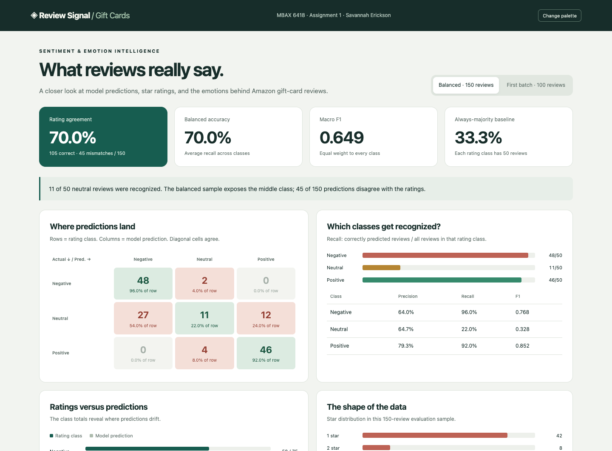
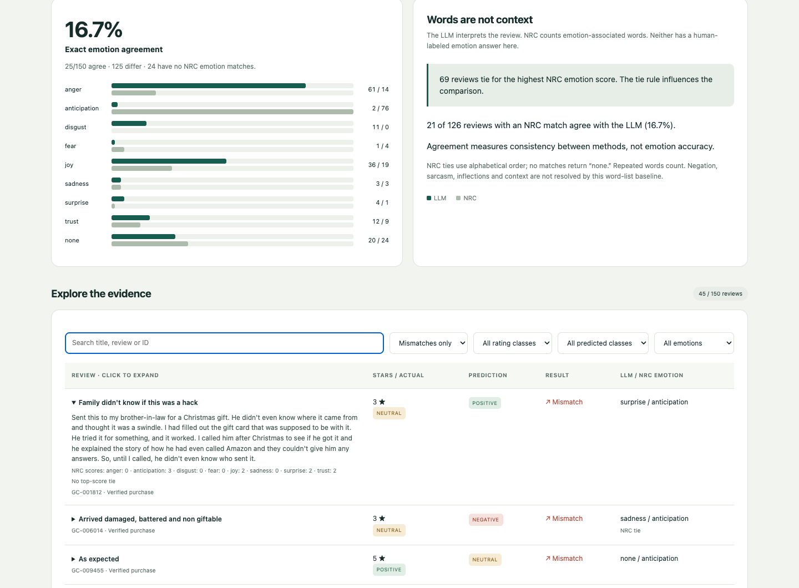

# Review Signal: Amazon Gift Cards

**MBAX 6418 · Assignment 1 · Savannah Erickson**

The model agrees with star ratings on **97.0%** of the first batch, but only **70.0%** of a balanced three-class sample. Neutral reviews are the main weakness: **11/50** are recognized. The LLM and NRC word list agree on the primary emotion in **25/150 reviews (16.7%)**.

Download this repository and open **[dashboard.html](dashboard.html)** in a browser. It is a single offline file; GitHub's file view shows its source rather than running it. The dashboard includes both evaluations, confusion matrices, class metrics, descriptive charts, emotion comparisons, searchable review text, and filters with live counts. The palette button switches themes; CSS variables support further recoloring.



## Data and approach

Data: the **Gift Cards** category of [Amazon Reviews ’23](https://amazon-reviews-2023.github.io/), collected by the McAuley Lab at UC San Diego. [Download the original gzip JSONL](https://mcauleylab.ucsd.edu/public_datasets/data/amazon_2023/raw/review_categories/Gift_Cards.jsonl.gz). Dataset reference: Hou et al. (2024), *Bridging Language and Items for Retrieval and Recommendation*.

The complete file was read successfully: **152,410 reviews**, including **134,940 (88.5%)** with positive ratings. The first evaluation uses the first **100 rows**, with ratings at least 4 positive and the rest negative. The final evaluation uses **50 reviews per class**, sampled across the whole file by stratified reservoir sampling with **seed 6418**: ratings 1–2 negative, 3 neutral, and 4–5 positive. Samples and source-file hashes are saved, so the selection is auditable.

Python sends only title and text to the class endpoint using **cyankiwi/Qwen3.6-35B-A3B-AWQ-4bit**, temperature **0**, seed **6418**, and a strict JSON schema. The numeric rating and other metadata never enter the request. Explicit phrases such as “Three Stars” are also redacted from review text; the saved `model_input` shows exactly what was sent. The dashboard preserves original text. This regex covers common explicit rating phrases, not every possible indirect clue.

The prompts specify mixed, terse, sarcastic and conflicting-title cases. The binary prompt resolves a balanced/factual review to negative; the final prompt can return neutral. Emotion is classified independently, with `none` allowed when no emotion is expressed. Two obvious positive/negative synthetic spot checks both passed; they are not included in evaluation metrics. No prompt was tuned to the final sample's rating labels.

## Why the first run looked strong

| Metric | First batch, binary | Balanced, three classes |
|---|---:|---:|
| Correct / total | 97/100 | 105/150 |
| Rating agreement | 97.0% | 70.0% |
| Always-majority baseline | 93.0% | 33.3% |
| Balanced accuracy (mean recall) | 91.8% | 70.0% |
| Macro F1 | 0.892 | 0.649 |

The first batch contains **93 positive and 7 negative** reviews. Always predicting positive already gets **93.0%** agreement. The model recognizes **6/7 negatives** and **91/93 positives**. Its binary matrix, with rows/columns ordered negative then positive, is **[[6, 1], [2, 91]]**.

Balancing makes the uncommon rating classes visible instead of allowing the positive majority to dominate. However, the two runs also change the label definition, prompt and sample, so the difference cannot be attributed to sampling alone. This is a descriptive comparison, not a controlled estimate of the effect of balancing, and the balanced accuracy is not a population-weighted deployment estimate.

## Where mistakes go

Rows are rating classes; columns are predictions.

| Actual / predicted | Negative | Neutral | Positive |
|---|---:|---:|---:|
| Negative | 48 | 2 | 0 |
| Neutral | 27 | 11 | 12 |
| Positive | 0 | 4 | 46 |

| Class | Correct / support | Precision | Recall | F1 |
|---|---:|---:|---:|---:|
| Negative | 48/50 | 64.0% | 96.0% | 0.768 |
| Neutral | 11/50 | 64.7% | 22.0% | 0.328 |
| Positive | 46/50 | 79.3% | 92.0% | 0.852 |

Of the neutral reviews, **27 become negative**, **12 become positive**, and only **11 stay neutral**. In the opposite direction, **2 negatives** and **4 positives** become neutral. No negatives become positive and no positives become negative in this sample. The model predicts **75 negatives, 17 neutrals and 58 positives**, despite equal rating-class counts. The dominant failure is a three-star review becoming negative.

Examples, searchable by ID in the dashboard:

- **GC-006014** has a neutral rating but complains about damaged gift packaging. The model calls it negative. The language plausibly expresses dissatisfaction even though the assignment's correct label is neutral.
- **GC-009455** is rated positive but says “As expected.” The model calls it neutral, illustrating how a terse factual statement may not communicate the satisfaction captured by its rating.
- **GC-001812** is rated neutral and describes confusion over an unexpected gift card. The model calls it positive; a successful redemption may have outweighed the surrounding complaint in its prediction. That explanation is an interpretation, not a recorded model rationale.

Ratings are the scoring reference, not a perfect annotation of text sentiment. These disagreements can include both model errors and differences between what the text expresses and the rating selected.

## LLM emotion versus the NRC word list

This project uses the [NRC Emotion Lexicon](https://saifmohammad.com/WebPages/NRC-Emotion-Lexicon.htm), created by **Saif M. Mohammad and Peter D. Turney at the National Research Council Canada**. Reference: Mohammad & Turney (2013), *Crowdsourcing a Word-Emotion Association Lexicon*, Computational Intelligence, 29(3), 436–465.

The word-list method lowercases the same rating-redacted title/text, removes HTML and the redaction marker, counts exact English word matches for the eight NRC emotions, and takes the largest score. Repeated words count. Ties use alphabetical order; all-zero scores return `none`. It does not resolve negation, sarcasm, word senses or inflections.

The methods agree on **25/150 (16.7%)** and disagree on **125**. There are **24** no-match reviews and **69** positive-score ties. Among the **126** reviews with an NRC match, **21 (16.7%)** agree. The LLM most often predicts anger (**61**); NRC most often predicts anticipation (**76**).

The category's vocabulary and tie rule help explain this: “gift” is associated with anticipation, joy and surprise, so alphabetical selection often favors anticipation. **GC-008976** has tied anticipation/joy/surprise scores; NRC returns anticipation while the LLM returns joy. **GC-004448** praises quality; the LLM returns joy but NRC finds no matching emotion words. **GC-006014** expresses disappointment about damage; the LLM returns sadness while NRC selects anticipation from a tie. Emotion agreement measures consistency, not accuracy: no human emotion labels were supplied, and the LLM can also misread the review.



## Issues encountered and verification

- The initial JSON-only response constraint allowed an unsupported emotion value. Validation stopped the run. Strict schema enums fixed this; the final saved evaluations were regenerated using the same response constraint. Failed requests are never silently scored as a class.
- Explicit star phrases in titles created a potential rating leak. The pipeline now redacts them and records the actual model input. The NRC tokenizer also removes the redaction marker so it cannot create artificial word matches.
- Network access and the headless browser initially failed inside the execution sandbox. They worked through the approved execution path; local analysis still runs without network access. The downloader loads the system CA bundle where available to fix missing certificate roots in the local Python installation, while preserving TLS verification.
- The word list often ties or has no matches. Both cases are recorded and displayed rather than hidden. The lexicon itself is not redistributed; `prepare_data.py` downloads it from its official source for educational use.
- Automated browser checks compare the visible metrics, matrix cells, charts and filtered row IDs with saved JSON. They exercise every status/class filter combination, emotion filters, search, an empty result, the palette button and a narrow mobile viewport. Nonzero chart bars are checked for nonzero rendered width. See [browser_checks.json](results/browser_checks.json). Python tests check rating boundaries, rating exclusion, emotion edge cases and saved metrics.

## Reproduce and inspect

Python **3.10+**, standard library only. Open the saved dashboard without installing anything. Rebuild the report and dashboard from saved results without an API key:

```bash
python3 build_dashboard.py
python3 build_report.py
python3 -m unittest discover -p 'test_*.py'
```

To reproduce sampling and make new model calls:

```bash
python3 prepare_data.py
export OPENAI_BASE_URL='http://dobolyi.com:9001/v1'
export OPENAI_MODEL='cyankiwi/Qwen3.6-35B-A3B-AWQ-4bit'
# Set OPENAI_API_KEY privately to the class key from the assignment.
python3 score_reviews.py --mode spotcheck
python3 score_reviews.py --mode binary
python3 score_reviews.py --mode balanced
python3 add_emotions.py
python3 build_dashboard.py
python3 build_report.py
python3 -m unittest discover -p 'test_*.py'
```

Fixed seeds and prompts reproduce the sample and settings. A remote model service may still change or behave nondeterministically, so new API calls are not guaranteed to reproduce every prediction. The saved raw responses are the authoritative evidence for this report. Re-running model commands overwrites their completed outputs; keep a copy before experimenting. Interrupted runs resume only from a matching checkpoint.

Optional browser verification: install Playwright (`npm install --no-save playwright` and `npx playwright install chromium`), then run `node verify_browser.cjs`. Alternatively set `CHROME_PATH` to an installed Chrome executable. This refreshes screenshots and `browser_checks.json`.

### Working files

- `prompts/`: reusable binary and three-class prompts.
- `prepare_data.py`: download, full-file validation, deterministic sampling and provenance.
- `score_reviews.py`: endpoint calls, input redaction, checkpoints, strict validation and sentiment scoring.
- `add_emotions.py`: NRC scoring and emotion comparison, with no model calls.
- `build_dashboard.py` + `dashboard_template.html`: self-contained dashboard generator.
- `build_report.py`: this report, with numbers pulled from saved results.
- `results/balanced_raw.json`: final balanced run including unmodified API responses and exact model inputs.
- `results/balanced_results.json`: the same run augmented with NRC scores; `binary_raw.json` and `spotcheck_raw.json` preserve earlier-stage evaluations.
- `results/*sample.json` and `data_manifest.json`: sampled reviews, source-line IDs, full-file counts and hashes.
- `assets/`: desktop and mobile interface screenshots.

Large source downloads, the NRC lexicon, credentials and local caches are excluded from Git. The saved review samples omit reviewer account IDs.

## Authorship and submission

This report and code were drafted with an AI agent using actual endpoint results. **Student review is still required before submission:** check the report against the saved output and express the interpretation in your own words. The report does not claim that this personal review has already happened. Submit the repository URL on Canvas after that review.
